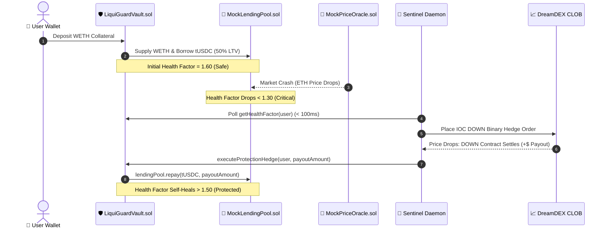

# 🛡️ LiquiGuard — Autonomous Zero-Liquidation DeFi Vaults on Somnia

[-8A2BE2?style=for-the-badge&logo=ethereum)](https://testnet.somnia.network/)
[](https://somnia.network/)
[](https://dev.smk.somnia.host/)
[](https://github.com/foundry-rs/foundry)
[](https://nextjs.org/)

> **LiquiGuard transforms predatory DeFi liquidations into an automated, self-healing micro-hedge on Somnia.** By combining Somnia's **sub-100ms finality** and **100k+ TPS** with **DreamDEX's central limit order book (CLOB)**, LiquiGuard intercepts undercollateralized positions before liquidators can extract value, executing binary `DOWN` hedges that automatically repay debt and restore vault health.

---

## 🌟 The Problem & The Somnia Solution

### ❌ The Legacy DeFi Flaw (Ethereum / L2s)
- **Predatory Liquidations**: When market crashes occur, third-party liquidators seize collateral with steep **5% to 15% liquidation penalties**.
- **Sluggish Block Times (12s)**: Slow block times prevent automated defense mechanisms from reacting before liquidations trigger.
- **Cascading Insolvency**: Flash crashes cause cascading liquidations, draining liquidity pools and user funds.

### ✨ The LiquiGuard Innovation on Somnia
- **Sub-100ms Reactive Sentinel**: Leverages Somnia's sub-second block times to detect Health Factor degradation ($HF < 1.30$) within milliseconds.
- **DreamDEX Binary Outcome Hedging**: Dispatches an Immediate-or-Cancel (IOC) `DOWN` order into DreamDEX's CLOB at entry price $P \approx \$0.40$.
- **Automated Self-Healing Payout**: Winning hedge payouts ($1.00 - P_{\text{entry}} = \$0.60$ profit per contract) are routed straight into `LiquiGuardVault.executeProtectionHedge()`, which invokes `MockLendingPool.repay()` to restore $HF > 1.50$ with **\$0 liquidation penalty to the user**.

---

## 🏗️ System Architecture



---

## 📐 Mathematical Protection Model

### 1. Health Factor Formulation
$$HF = \frac{\text{Collateral}_{\text{USD}} \times LT}{\text{Debt}_{\text{USD}}} = \frac{(Q_{\text{WETH}} \times P_{\text{ETH}}) \times 0.80}{\text{Debt}_{\text{tUSDC}}}$$

- **$HF \ge 1.50$**: 🟢 **SAFE** (Normal Operations)
- **$1.30 \le HF < 1.50$**: 🟡 **WARNING** (Volatility Watch)
- **$HF < 1.30$**: 🚨 **CRITICAL / HEDGE TRIGGER**
- **$HF \le 1.00$**: ❌ **LIQUIDATION THRESHOLD** (Intercepted & Prevented)

### 2. Delta-Neutral Hedge Sizing ($Q_{\text{hedge}}$)
To restore the Health Factor from critical ($HF_{\text{current}}$) back to target ($HF_{\text{target}} = 1.50$), the required debt repayment ($\Delta L$) is:

$$\Delta L = \text{Debt}_{\text{current}} - \frac{\text{Collateral}_{\text{USD}} \times LT}{HF_{\text{target}}}$$

Given DreamDEX binary contract entry price $P_{\text{entry}}$ (e.g. $\$0.40$), the payout on a market drop is $\$1.00$ per contract, yielding a net profit of $(1.00 - P_{\text{entry}}) = \$0.60$. The required hedge contract size is:

$$Q_{\text{hedge}} = \frac{\Delta L}{1 - P_{\text{entry}}}$$

---

## 🚀 Deployed Smart Contracts (Somnia Shannon Testnet)

All smart contracts are verified and live on **Somnia Shannon Testnet (Chain ID: `50312`)**:

| Contract | Address | Explorer |
|---|---|---|
| **`LiquiGuardVault`** | `0x14b2bb3f8a25301d6ea944d571f0e7608d36c095` | [View on Explorer](https://shannon-explorer.somnia.network/address/0x14b2bb3f8a25301d6ea944d571f0e7608d36c095) |
| **`MockLendingPool`** | `0x96b90274a27d7c933816ae6eae9959b3be05d260` | [View on Explorer](https://shannon-explorer.somnia.network/address/0x96b90274a27d7c933816ae6eae9959b3be05d260) |
| **`MockPriceOracle`** | `0xDD2A460Bfe22BfA7c757A35F6d68813770d39712` | [View on Explorer](https://shannon-explorer.somnia.network/address/0xDD2A460Bfe22BfA7c757A35F6d68813770d39712) |
| **`MockERC20 (WETH)`** | `0x36971ac6e98aafde5c0e2ee8d55abd6c45db8283` | [View on Explorer](https://shannon-explorer.somnia.network/address/0x36971ac6e98aafde5c0e2ee8d55abd6c45db8283) |
| **`MockERC20 (tUSDC)`**| `0x734a4b4d43aec0d7d58e3bae6e7b4a8fa253fd5e` | [View on Explorer](https://shannon-explorer.somnia.network/address/0x734a4b4d43aec0d7d58e3bae6e7b4a8fa253fd5e) |

---

## 🎨 Next-Gen UI & Apple-Style Scrollytelling

- **80-Frame Quantum Prism Sequence**: Built with HTML5 Canvas hardware acceleration and cubic ease-out curve, providing an Apple AirPods Pro-style scroll-driven experience.
- **Glassmorphic Bento Grid**: Real-time radial Health Factor gauge, DreamDEX CLOB order book depth visualizer, and live on-chain event stream.
- **Interactive Crash Simulator Arena**: Allows hackathon judges to trigger market crashes from `-5%` to `-35%` and observe sub-second on-chain micro-hedging live.

---

## 💻 Local Development & Reproduction Guide

### Prerequisites
- **Node.js**: `v18.0.0+`
- **Foundry**: `forge` / `cast`
- **Python**: `3.10+` (optional, for frame generation pipeline)

### 1. Clone & Install
```bash
git clone https://github.com/Adityakk9031/liquiguard-somnia.git
cd liquiguard-somnia
npm install
```

### 2. Environment Configuration
```bash
cp .env.example .env
# Pre-configured with deployed contract addresses
```

### 3. Run Smart Contract Tests (Foundry)
```bash
cd contracts
forge test -vvv
```

### 4. Start the Full Stack (Frontend + Daemon)
From the root directory:
```bash
npm run dev
```
- **Next.js Web Dashboard**: [http://localhost:3000](http://localhost:3000)
- **Sentinel Daemon REST API**: [http://localhost:3001/api/status](http://localhost:3001/api/status)

---

## 📂 Repository Structure

```
liquiguard-somnia/
├── contracts/                  # Solidity 0.8.24 Smart Contracts
│   ├── src/
│   │   ├── LiquiGuardVault.sol # Core autonomous vault with operator hedge execution
│   │   ├── MockLendingPool.sol # Aave V2 style pool with liquidation threshold
│   │   ├── MockPriceOracle.sol # Dynamic oracle with simulator hooks
│   │   └── MockERC20.sol       # WETH (18 dec) & tUSDC (6 dec) tokens
│   ├── test/                   # Comprehensive Foundry test suites
│   └── script/                 # Somnia deployment scripts
├── daemon/                     # TypeScript Sentinel Keeper Service
│   ├── src/
│   │   ├── monitor.ts          # Real-time Health Factor polling engine
│   │   ├── executor.ts         # DreamDEX IOC order placement & keeper relayer
│   │   ├── dreamdex.ts         # DreamDEX SDK client (Mock + Live GraphQL)
│   │   ├── store.ts            # Fast SQLite & in-memory session cache
│   │   └── api.ts              # REST API & simulation telemetry endpoints
├── frontend/                   # Next.js 14 Web Application
│   ├── src/
│   │   ├── components/         # Scrollytelling canvas, Bento grid, Gauges
│   │   ├── lib/                # Wagmi, Viem, Somnia chain configs
│   │   └── app/                # Layout, pages, and Tailwind styling
└── scripts/                    # Frame extraction and AI video generation tools
```

---

## 🏆 Somnia Hackathon Tracks & Impact
- **Track**: DeFi & Infrastructure
- **Network Alignment**: Demonstrates how Somnia's unique sub-100ms finality makes previously impossible financial primitives (like automated micro-hedging before liquidation) a reality on-chain.

---

## 📜 License
MIT License. Built with ❤️ for the Somnia Network Ecosystem.
